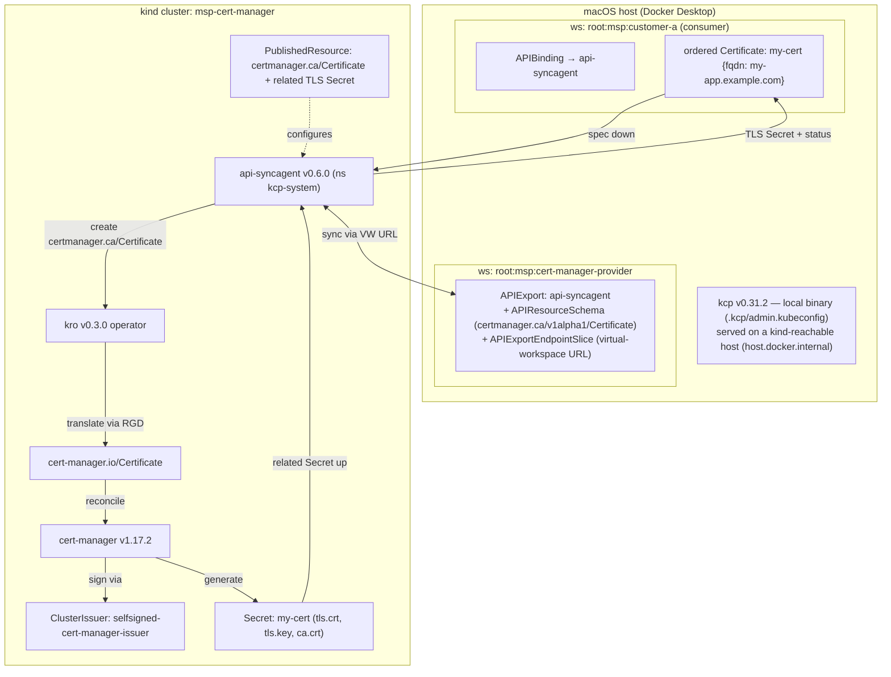

# Architecture — cert-manager MSP on kcp + api-syncagent + kro

This example turns **TLS certificate issuance into an orderable service** on a kcp control plane. A
consumer creates a `certmanager.ca/v1alpha1/Certificate` in their own kcp workspace; the kcp
**api-syncagent** syncs it down to a backing **kind** cluster where **kro** translates it into a
real `cert-manager.io/Certificate`, **cert-manager** signs it, and the resulting TLS `Secret` syncs
back up to the consumer workspace.

No custom operator is written. The entire provider is declarative YAML.

## Pinned, matched stack
- **kcp v0.31.2** (local binary, pinned in `bin/`)
- **api-syncagent v0.6.0** (targets kcp 0.31; Helm chart `kcp/api-syncagent`)
- **cert-manager v1.17.2** (operator in kind)
- **kro v0.3.0** (ResourceGraphDefinition translator in kind)

## Flow

## Step sequence (what `task up` automates)

1. **Pin kcp** v0.31.2 into `bin/`.
2. **Start kcp** with generated URLs on a kind-reachable host (`host.docker.internal`).
3. **Create workspaces**: `root:msp:cert-manager-provider` (provider) and `root:msp:customer-a`
   (consumer); apply the initial empty `APIExport` in the provider workspace.
4. **Create kind cluster** `msp-cert-manager`.
5. **Install cert-manager** v1.17.2 into kind; apply the self-signed `ClusterIssuer`.
6. **Install kro** v0.3.0 into kind; apply the `ResourceGraphDefinition` that registers
   `certmanager.ca/v1alpha1/Certificate` and translates it to `cert-manager.io/Certificate`.
7. **Build the provider-workspace kubeconfig**, store it as a `Secret` in kind (`kcp-system`).
8. **Install api-syncagent** v0.6.0 (Helm) into kind, pointed at the provider APIExport.
9. **Publish** the `certmanager.ca/Certificate` API via a `PublishedResource` (+ on-kind RBAC +
   related TLS Secret). The agent generates the `APIResourceSchema` and fills the provider `APIExport`.
10. **Bind** in the consumer workspace (`APIBinding` → provider export) so `certmanager.ca/Certificate`
    is served there.

Then `task order` creates a `Certificate` in the consumer workspace, and `task verify` proves the loop.

## Key design notes

- **No resource-broker**: consumers bind the provider's api-syncagent `APIExport` directly. The
  cert-manager provider is self-contained — no generic routing layer is needed for a single-provider
  setup.
- **KRO as a translation layer**: `certmanager.ca/Certificate` is the kro-generated "product API"
  (a simple CRD with `spec.fqdn`). kro translates it into the more complex `cert-manager.io/Certificate`
  spec. This keeps the consumer-facing API minimal while delegating cert-manager-specific knowledge
  to the RGD.
- **Secret naming**: `spec.secretName` in `cert-manager.io/Certificate` is set to the Certificate
  object name (via `rgd.yaml`). The `PublishedResource` related-resource template `{{ .Object.metadata.name }}`
  resolves correctly on both sides because single-consumer naming is preserved end-to-end.
- **Naming (goal-1 simplification)**: `config/syncagent/publishedresource-certificate.yaml` includes a
  `naming` block that preserves consumer names on kind (`my-cert` / `default`). **Must be removed**
  before multi-consumer goal 2 work — two consumers ordering the same name would collide on kind.
- **Connectivity** (the main risk): kcp must serve URLs reachable from inside kind. Implemented
  via `--bind-address=0.0.0.0` and `--shard-base-url=https://host.docker.internal:6443`, which
  (a) puts `host.docker.internal` in the serving-cert SANs, and (b) causes the
  `APIExportEndpointSlice` virtual-workspace URL to be `host.docker.internal`-based. Two kubeconfigs
  result: `admin.kubeconfig` is rewritten to `127.0.0.1` for host-side CLI use; the agent's
  kubeconfig Secret points at `host.docker.internal`. The agent uses `insecure-skip-tls-verify`
  for its bootstrap connection. No fallback variant needed with Docker Desktop.
