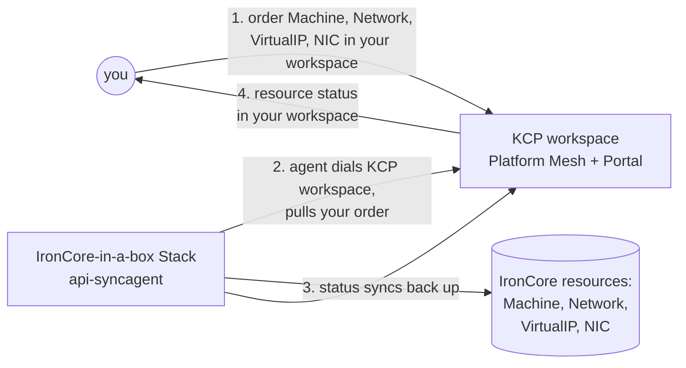

# msp-ironcore

Order IronCore compute and networking resources through Platform Mesh and watch
them be provisioned in a local IronCore-in-a-box cluster. The setup uses two clusters:
- **KCP** is the KCP system as made available using Platform Mesh (e.g. local-setup)
- **IronCore-in-a-box** cluster runs the full IronCore stack + the kcp
api-syncagent.

<p align="center">
  
</p>

## How it works



You order in your KCP workspace; the api-syncagent in the IronCore-in-a-box cluster pulls the order down, IronCore controllers provision the resources (VM, overlay network, virtual IP, network interface, ...), and status syncs back to your workspace.
Full topology: [`docs/architecture.md`](docs/architecture.md).

## Prerequisites

- `kind`, `kubectl`, `helm`, `task` (`brew install go-task`), `go`, `make`, and
  the `kubectl-ws` plugin (installed by local-setup)
- Check the prerequisites of [IronCore-in-a-Box](https://github.com/ironcore-dev/ironcore-in-a-box#prerequisites), especially [docker-mac-net-connect](https://github.com/chipmk/docker-mac-net-connect)

---

## 1. Stand up KCP with Platform-Mesh
checkout of the [helm-charts](https://github.com/platform-mesh/helm-charts) repo on the appropriate branch. Below, `<helm-charts>` is the absolute path to that checkout.

From `<helm-charts>`:

```sh
task local-setup:example-data
```

Wait for it to be Ready:

```sh
kubectl --context kind-platform-mesh -n platform-mesh-system get platformmesh
# READY=True
```

## 2. Establish a contract
As IronCore-in-a-Box provider, you establish a business contract with the owner of the Platform-Mesh. In return you receive a provider service account with which you can register under `root:providers:ironcore-provider` and advertise your services.

```sh
cp ../../helm-charts/.secret/kcp/admin.kubeconfig kcp-admin.kubeconfig
export PM_KUBECONFIG="$(realpath kcp-admin.kubeconfig)"

KUBECONFIG=$PM_KUBECONFIG kubectl create-workspace ironcore-provider \
  --type=root:provider --ignore-existing \
  --server=https://kcp.api.portal.localhost:8443/clusters/root:providers

KUBECONFIG=$PM_KUBECONFIG kubectl apply \
  --server=https://kcp.api.portal.localhost:8443/clusters/root:providers:ironcore-provider \
  -f config/kcp/apiexport.yaml

KUBECONFIG=$PM_KUBECONFIG kubectl apply \
  --server=https://kcp.api.portal.localhost:8443/clusters/root:providers:ironcore-provider \
  -k config/provider
```

The api-syncagent v0.6.0 doesn't create the `APIExport` itself — it resolves
an existing one (or refuses to start). The empty `APIExport` above gets filled
in with resource schemas and permission claims when `task syncagent:publish`
applies the `PublishedResource` CRs on the ironcore-in-a-box cluster.

[`config/provider`](config/provider) is the portal-side bootstrap:
`ProviderMetadata` (listing entry — name, description, icon, contacts),
`ContentConfiguration` (adds "Machines", "Networks", "Virtual IPs",
"Network Interfaces", and "Secrets" nav nodes rendered via the default portal's
`generic-list-view` web component — no custom portal service), and RBAC that
lets account workspaces auto-bind the export.

## 3. Stand up the IronCore-in-a-box cluster
Read the [IronCore-in-a-Box Installation](https://github.com/ironcore-dev/ironcore-in-a-box#installation) and execute the installation task. In short:
```sh
cd ironcore-in-a-box
make up
```
In some cases (laptop hibernated, network stack reseted, ...), if a network related pod does not start, execute:
```sh
make setup-network
```

## 4. Connect the IronCore-in-a-box provider with the Platform-Mesh
Install the api-syncagent into the IronCore-in-a-box cluster and let it connect with Platform-Mesh:
```sh
task syncagent:kubeconfig syncagent:install syncagent:publish
```

Each step is idempotent — safe to re-run if anything hiccups.

## 5. Create a consumer workspace and order resources

Setup the Platform-Mesh org, and tenant/consumer workspace. Enable the IronCore-in-a-box provider (visually) via the marketplace tile.

Download the kubeconfig for your workspace.

Order the example machine with associated resources:
```sh
KUBECONFIG=dowloaded-workspace-kubeconfig.yaml kubectl apply -f ironcore-in-a-box/examples/machine/machine.yaml
```

Once the machine is running, login and verify
```sh
ip=$(kubectl get virtualip webapp -o jsonpath='{.status.ip}')
ssh ironcore@$ip
# password is "best123"
```

Cleanup your machine order with
```sh
KUBECONFIG=dowloaded-workspace-kubeconfig.yaml kubectl delete -f ironcore-in-a-box/examples/machine/machine.yaml
```
