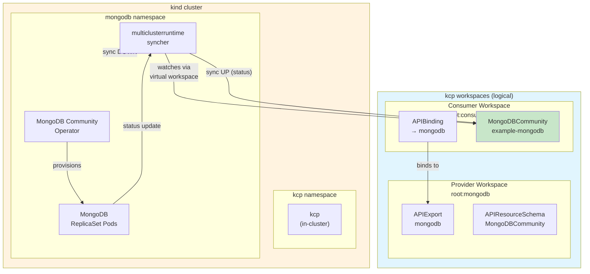

# Architecture — msp-mongodb-multiclusterruntime

This document describes the architecture of the MongoDB MSP example.

## Overview

This example is **different from `msp-postgres-kcp-only` and `msp-httpbin-operator`**:
- kcp runs **inside** the kind cluster (not as a host process)
- Uses a **custom syncher** based on [multiclusterruntime](https://github.com/kcp-dev/multiclusterruntime) instead of [api-syncagent](https://github.com/kcp-dev/api-syncagent)
- The syncher is specific to the MongoDB CRD

## Flow

1. **Consumer orders a MongoDB** — The consumer creates a `MongoDBCommunity` CR in their kcp workspace (`root:consumer`).

2. **Syncher watches via virtual workspace** — The syncher connects to kcp's virtual workspace URL (from the `APIExportEndpointSlice`) and watches for `MongoDBCommunity` resources across all bound consumer workspaces.

3. **Syncher syncs DOWN** — When it sees a new `MongoDBCommunity`, it creates a corresponding CR in the kind cluster's `mongodb` namespace.

4. **MongoDB Operator provisions** — The MongoDB Community Operator (running in kind) watches for `MongoDBCommunity` CRs and provisions the actual MongoDB ReplicaSet pods.

5. **Status syncs UP** — The operator updates the CR's `.status` (phase, version). The syncher watches for these updates and syncs the status back to the consumer's CR in kcp.

6. **Consumer sees Running state** — The consumer can now see their MongoDB is `Running` with the provisioned version.

## Key Differences from api-syncagent Examples

| Aspect | api-syncagent (postgres/httpbin) | multiclusterruntime (mongodb) |
|--------|----------------------------------|-------------------------------|
| kcp location | Host process | Inside kind cluster |
| Sync mechanism | api-syncagent (generic) | Custom syncher (CRD-specific) |
| Virtual workspace | Agent follows APIExportEndpointSlice | Syncher connects to VW URL |
| Use case | Generic passthrough | Custom sync logic needed |
| Production ready | More mature | Example/barebone |

## Components

| Component | Location | Purpose |
|-----------|----------|---------|
| kcp | kind / kcp namespace | Control plane — hosts workspaces, APIExports, APIBindings |
| multiclusterruntime syncher | kind / mongodb namespace | Syncs MongoDBCommunity CRs between kcp and kind |
| MongoDB Community Operator | kind / mongodb namespace | Provisions actual MongoDB ReplicaSets |
| MongoDB pods | kind / mongodb namespace | The actual database instances |

## Why custom syncher?

The `multiclusterruntime` library is useful when:
- You need custom sync logic beyond what api-syncagent provides
- You want to transform objects during sync
- You need to handle object collisions differently
- You're building a CRD-specific sync solution

This example demonstrates a **barebone** custom syncher. It does **not** handle:
- Object collision detection across workspaces
- Related resources (secrets, etc.)
- Complex status reconciliation

For most use cases, [api-syncagent](https://github.com/kcp-dev/api-syncagent) is the recommended approach.
