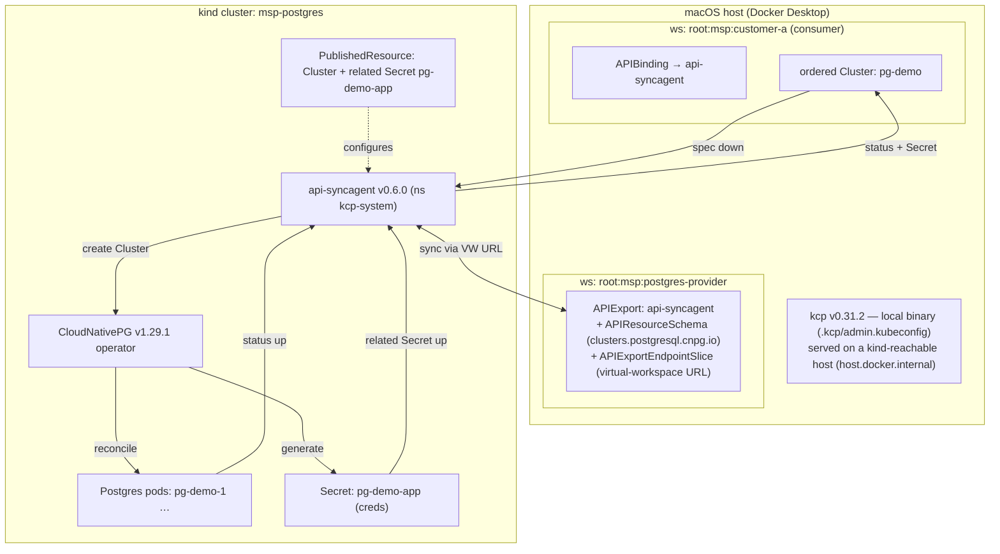

# Architecture — Postgres MSP on Platform Mesh (kcp + api-syncagent + CloudNativePG)

This example turns **PostgreSQL into an orderable service** on a kcp control plane. A consumer
creates a CloudNativePG `Cluster` in their own kcp workspace; the kcp **api-syncagent** syncs it
down to a backing **kind** cluster where the **CloudNativePG (CNPG)** operator provisions a real
PostgreSQL instance. Status and the generated connection `Secret` flow back up to the consumer.

## Pinned, matched stack
- **kcp v0.31.2** (local binary, pinned in `bin/`)
- **api-syncagent v0.6.0** (targets kcp 0.31; Helm chart `kcp/api-syncagent`)
- **CloudNativePG v1.29.1** (operator in kind)

## Flow

## Step sequence (what `task up` automates)
1. **Pin kcp** v0.31.2 into `bin/`.
2. **Start kcp** with generated URLs on a kind-reachable host (`host.docker.internal`).
3. **Create workspaces**: `root:msp:postgres-provider` (provider) and `root:msp:customer-a`
   (consumer); apply the initial empty `APIExport` in the provider workspace.
4. **Create kind cluster** `msp-postgres`.
5. **Install CNPG** v1.29.1 into kind.
6. **Build the provider-workspace kubeconfig**, store it as a `Secret` in kind (`kcp-system`).
7. **Install api-syncagent** v0.6.0 (Helm) into kind, pointed at the provider APIExport.
8. **Publish** the CNPG `Cluster` API via a `PublishedResource` (+ on-kind RBAC + related Secret).
   The agent generates the `APIResourceSchema` and fills the provider `APIExport`.
9. **Bind** in the consumer workspace (`APIBinding` → provider export) so `clusters.postgresql.cnpg.io`
   is served there.

Then `task order` creates a `Cluster` in the consumer workspace, and `task verify` proves the loop.

## Key design notes
- **Passthrough API**: consumers order CNPG's *native* `Cluster` — no custom operator (goal 1). A
  simplified `PostgresInstance` abstraction is the planned goal 2.
- **Naming (goal-1 simplification)**: `config/syncagent/publishedresource-cluster.yaml` includes a
  `naming` block that preserves the consumer's name + namespace on kind (`pg-demo` / `default`),
  making on-kind objects predictable for a single consumer. This is **safe only because goal 1 is
  single-consumer/single-order**. The api-syncagent's default anti-collision hashing must be
  restored (by removing the `naming` block) before goal 2 multi-consumer work — two consumers
  ordering the same name would otherwise collide on kind.
- **Connectivity** (the main risk): kcp must serve URLs reachable from inside kind. Implemented
  variant: kcp starts with `--bind-address=0.0.0.0` and `--shard-base-url=https://host.docker.internal:6443`,
  which (a) puts `host.docker.internal` in the serving-cert SANs, and (b) causes the
  `APIExportEndpointSlice` virtual-workspace URL to be `host.docker.internal`-based — exactly what
  the in-kind agent follows. Two kubeconfigs result: `admin.kubeconfig` is rewritten to `127.0.0.1`
  for host-side CLI use; the agent's kubeconfig Secret (built by `syncagent:kubeconfig`) points at
  `host.docker.internal` (Docker Desktop injects this into every container). The agent uses
  `insecure-skip-tls-verify` for its bootstrap API connection; virtual-workspace TLS is validated
  against the CA (which has `host.docker.internal` as a SAN). No fallback variant needed with Docker Desktop.
- **Credentials**: CNPG generates `pg-demo-app`; it is synced back to the consumer workspace as a
  `related` resource so the order is immediately usable.
