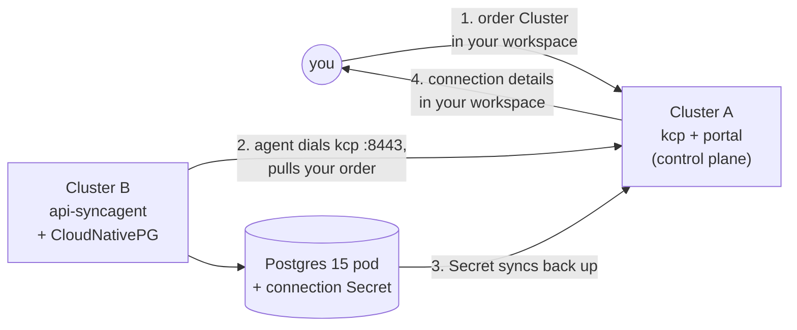

# msp-postgres-localsetup

Order a PostgreSQL 15 database through Platform Mesh and watch the connection
details come back to your workspace. Uses two kind clusters: **cluster A** is
the Platform Mesh local-setup (control plane); **cluster B** is created here
and runs CloudNativePG + the kcp api-syncagent.

## How it works



You order in cluster A; the api-syncagent in cluster B pulls the order down,
CloudNativePG provisions a real Postgres pod, and the connection Secret syncs
back up to your workspace. Full topology: [`docs/architecture.md`](docs/architecture.md).

## Prerequisites

- Docker Desktop (macOS, verified on arm64)
- `kind`, `kubectl`, `helm`, `task` (`brew install go-task`), and the
  `kubectl-ws` plugin (installed by local-setup)
- A checkout of the
  [helm-charts](https://github.com/platform-mesh/helm-charts) repo on branch
  `feat/msp-postgres-localsetup`. Below, `<helm-charts>` is the absolute path
  to that checkout.

---

## 1. Stand up Cluster A (control plane)

From `<helm-charts>`:

```sh
task local-setup:example-data
```

Wait for it to be Ready:

```sh
kubectl --context kind-platform-mesh -n platform-mesh-system get platformmesh
# READY=True
```

## 2. Stand up Cluster B (data plane)

From this directory:

```sh
task kind:up cnpg:install syncagent:kubeconfig syncagent:install syncagent:publish
```

Each step is idempotent — safe to re-run if anything hiccups.

## 3. Create a consumer workspace and order a database

```sh
KUBECONFIG=<helm-charts>/.secret/kcp/admin.kubeconfig \
  kubectl create-workspace consumer-pg --ignore-existing \
  --server=https://localhost:8443/clusters/root

task bind   CONSUMER_WS=root:consumer-pg
task order  CONSUMER_WS=root:consumer-pg
```

## 4. Verify

```sh
task verify CONSUMER_WS=root:consumer-pg
```

Expected: **`✅ E2E PASS`**. Your `Cluster` was synced to B, CloudNativePG
provisioned a real Postgres 15 pod, status and the connection `Secret` synced
back to your consumer workspace byte-identical, and a live `SELECT version();`
returned `PostgreSQL 15.x`.

## 5. Clean up

```sh
task down                                  # delete cluster B
kind delete cluster --name platform-mesh   # delete cluster A
```
