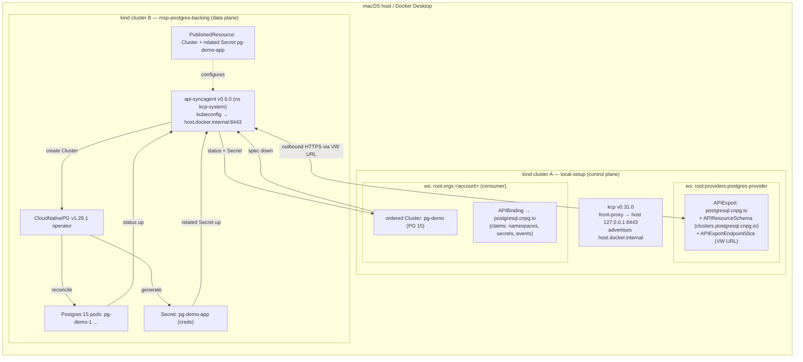

# Architecture — Postgres 15 MSP on Platform Mesh local-setup (backing DB in a second kind cluster)

This variant turns **PostgreSQL 15 into an orderable service** on the Platform Mesh **local-setup**
control plane, with the **data plane in a separate kind cluster**. A consumer creates a CloudNativePG
`Cluster` in their account workspace (cluster A); the kcp **api-syncagent** — running in a *second*
kind cluster (cluster B) and dialling *outbound* to A's kcp — syncs it down to B, where the
**CloudNativePG (CNPG)** operator provisions a real PostgreSQL 15 instance. Status and the generated
connection `Secret` flow back up to the consumer. No custom operator (CNPG-native passthrough).

## Pinned, matched stack
- **kcp v0.31.0** — provided by cluster A (local-setup); not a host binary here.
- **api-syncagent v0.6.0** (targets kcp 0.31; Helm chart `kcp/api-syncagent`) — in cluster B.
- **CloudNativePG v1.29.1** (operator in cluster B).
- **PostgreSQL 15** — the ordered `Cluster` pins `ghcr.io/cloudnative-pg/postgresql:15`.

## Flow

## Step sequence

Cluster A (helm-charts, Workstream A) is stood up first: the `postgresql.cnpg.io` APIExport in
`root:providers:postgres-provider`, portal registration, the per-account `APIBinding`, and kcp
advertising `host.docker.internal`. Then, in cluster B (this directory):

1. **Create the backing kind cluster** `msp-postgres-backing` (shares the default `kind` Docker network with A).
2. **Install CNPG** v1.29.1 into B.
3. **Build the provider-workspace kubeconfig** from A's admin kubeconfig (server rewritten to
   `https://host.docker.internal:8443/clusters/root:providers:postgres-provider`,
   `insecure-skip-tls-verify`), store it as a `Secret` in B (`kcp-system`).
4. **Install api-syncagent** v0.6.0 (Helm) into B, pointed at the `postgresql.cnpg.io` APIExportEndpointSlice.
5. **Publish** the CNPG `Cluster` API via a `PublishedResource` (+ on-cluster RBAC + related Secret).
   The agent generates the `APIResourceSchema` and fills A's `postgresql.cnpg.io` APIExport.

Then `task order` creates a PG-15 `Cluster` in the consumer account workspace, and `task verify`
proves the loop (pod Ready in B; status + Secret synced back to A; live `SELECT version()` → 15.x).

## Key design notes
- **Passthrough API**: consumers order CNPG's *native* `Cluster` — no custom operator (goal 1).
- **APIExport name = `postgresql.cnpg.io`** (the CNPG group name) — the integration contract with
  Workstream A. `config/syncagent/values.yaml` sets `apiExportName` + `apiExportEndpointSliceName`
  to it. APIExport names are arbitrary in kcp, so passthrough works the same as the standalone
  example's `api-syncagent` export.
- **Naming (goal-1 simplification)**: `config/syncagent/publishedresource-cluster.yaml` keeps the
  `naming` block that preserves the consumer's name + namespace on cluster B (`pg-demo` / `default`),
  making on-cluster objects predictable for a single consumer. **Safe only because goal 1 is
  single-consumer/single-order**; remove the `naming` block to restore the agent's default
  anti-collision hashing before any multi-consumer (goal 2) work.
- **Connectivity** (the main risk): the agent in B reaches A's kcp over **two hops**, both via
  `host.docker.internal:8443` — (1) the bootstrap kubeconfig server, (2) the
  `APIExportEndpointSlice` virtual-workspace URL host that A advertises. Docker Desktop injects
  `host.docker.internal` into containers; the agent uses `insecure-skip-tls-verify` for the bootstrap
  connection. If DNS fails inside B, the `hostAliases` fallback in `values.yaml` maps the name to the
  `kind` network host-gateway. The A-side reachability change (advertise `host.docker.internal`) is
  owned by Workstream A.
- **permissionClaims trap**: the account `APIBinding` must `Accept` all three auto-added claims —
  `namespaces`, `secrets`, `events` — or the connection Secret never syncs back (silent failure).
- **Credentials**: CNPG generates `pg-demo-app`; it is synced back to the consumer workspace as a
  `related` resource so the order is immediately usable.
